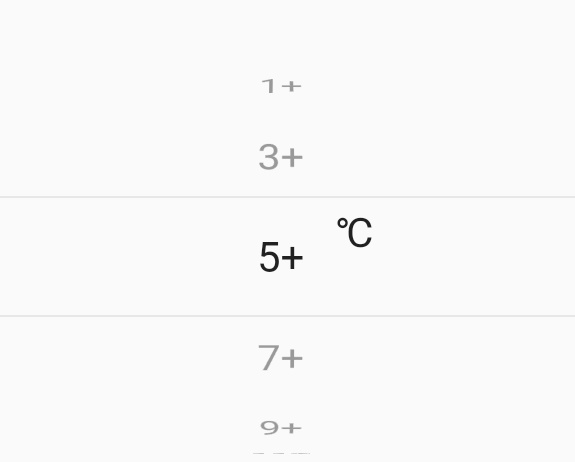
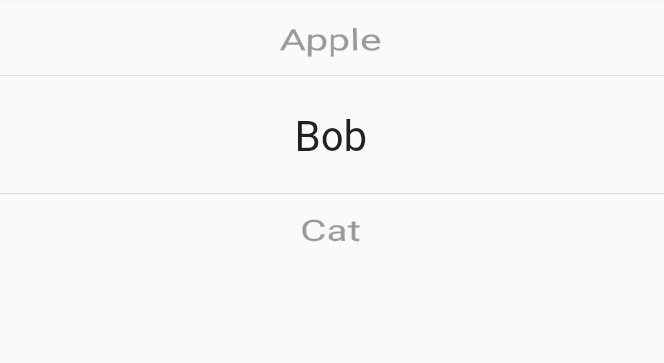
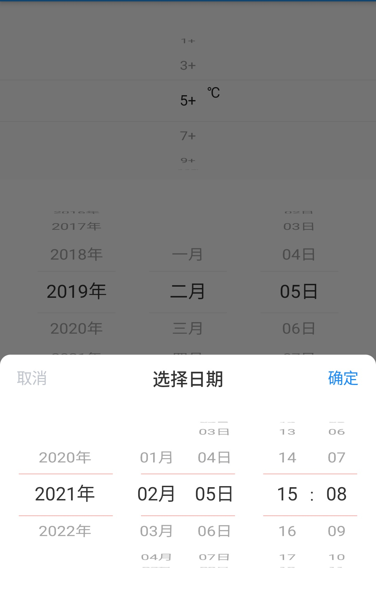

`dh_picker` 选择器控件，支持数字选择，字符串选择，日期选择，自定义选择。
在你的项目pubspec.yaml添加如下依赖

```
dependencies:
  dh_picker: ^1.0.0
```

`num_picker` 数字选择器



`max` 最大值

`min` 最小值

`interval` 间隔值

`indexFormat`  格式化函数，可以格式化每项

```
NumberPicker(
    max: 21,
    min: 1,
    interval: 2,
    indexFormat: (value) => "$value+",
    itemExtent: 40,
    onSelectedItemChanged: (value) {
      print('selected  value: $value');
    },
    labelAlignment: Alignment.center,
    label: Text("℃"),
    labelPadding: EdgeInsets.only(left: 50, bottom: 16),
  ),
)
```

`string_picker` 字符串选择器



```
StringPicker(
    itemExtent: 40,
    data: ['Apple', 'Bob', 'Cat'],
    onSelectedItemChanged: (String value) {
      print('selected  value: $value');
    },
  )
```

`date_picker` 日期时间选择器，参考[flutter_date_picker](https://github.com/Realank/flutter_datetime_picker)



`pickerModel`选择器数据模型，已支持下列模型。

- `DatePickerModel` 日期（xxxx年xx月xx日）

- `DateTimePickerModel` 日期时间（xxxx年xx月xx日 xx时:xx分:xx秒）
- `QuarterPickerModel` 日期季度 （xxxx年第一季度）
- `SemiannualPickerModel` 日期半年度 （xxxx年上半年）
- `TimePickerModel` 时间（xx时:xx分:xx秒）无范围限制。
- `TimeRangePickerModel` 时间范围 （xx时:xx分:xx秒）相比`TimePickerModel`可设置最大最小时间范围。

`pickerModel` 参数介绍：

`currentTime` 当前日期时间，未设置使用系统当前时间。

`maxTime` 最大日期时间

`minTime` 最小日期时间

`formats` 日期格式化。数组类型，长度由当前模型特性(内部picker个数)决定。 根据picker类型格式化，例如年通常格式化为： yyyy，季度格式化：QQQQ(第一季度)，QQQ(一季度)。年月日补充说明，它们的格式化补0，多语言其它地区不需要单位，根据label来决定是否显示单位（年月日）。

`label` 标识单位是否显示

`weights` 内部picker控件权重

`dividers` 内部picker间隔符

`pickerOverlay`  选择器上覆盖层，通常用于添加分割线。

每个选择器都可以设置`selectionOverlay`。设置`pickerOverlay` 自定义Overlay，`pickerOverlay` 会在当前Picker上添加Overlay。也可以设置`selectionOverlayBuilder`为每个内部picker添加Overlay，如果未设置会添加一个默认的Overlay。

注意使用`pickerOverlay`时，需要设置`selectionOverlayBuilder: (int index) => null`。

```
showPicker(context, builder: (BuildContext context) {
  return DateTimePickerWidget(
    onConfirm: (DateTime dateTime) {
      selectTime = dateTime;
      print('date time: $dateTime');
    },
    title: "选择日期",
    titleActionTheme: TitleActionTheme(
      decoration: ShapeDecoration(
          color: Colors.white,
          shape: RoundedRectangleBorder(
              borderRadius: BorderRadius.only(
                  topLeft: Radius.circular(10.0),
                  topRight: Radius.circular(10.0)))),
    ),
    onCancel: () {
      print('取消了');
    },
    pickerTheme: PickerTheme(
      height: 180.0,
    ),
    pickerModel: DateTimePickerModel(
      maxTime: DateTime(2022, 12, 1, 5, 6),
      minTime: DateTime(2020, 11, 2, 3, 4),
      currentTime: selectTime,
    ),
    pickerOverlay: Row(
      crossAxisAlignment: CrossAxisAlignment.stretch,
      children: [
        SizedBox(
          width: 18,
        ),
        Expanded(
            child: DefaultSelectionOverlay(
          borderColor: Colors.red,
        )),
        SizedBox(
          width: 27,
        ),
        Expanded(
            child: DefaultSelectionOverlay(
          borderColor: Colors.red,
        )),
        SizedBox(
          width: 27,
        ),
        Expanded(
            child: DefaultSelectionOverlay(
          borderColor: Colors.red,
        )),
        SizedBox(
          width: 18,
        ),
      ],
    ),
    selectionOverlayBuilder: (int index) => null,
  );
});
```